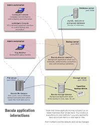

.. Bacula documentation master file, created by
   sphinx-quickstart on Wed Apr 24 11:45:26 2019.
   You can adapt this file completely to your liking, but it should at least
   contain the root `toctree` directive.

Introducción a Bacula
==================================

Definición
------

Bacula es un conjunto de programas informáticos que le permite al administrador del sistema administrar copias de seguridad, recuperación y verificación de datos de la computadora a través de una red de computadoras de diferentes tipos. Bacula también puede ejecutarse por completo en una sola computadora y puede realizar copias de seguridad en varios tipos de medios, incluidos cinta y disco.
En términos técnicos, es un programa de respaldo basado en cliente / servidor de red. Bacula es relativamente fácil de usar y eficiente, y ofrece muchas funciones avanzadas de administración de almacenamiento que facilitan la búsqueda y recuperación de archivos perdidos o dañados. Debido a su diseño modular, Bacula es escalable desde pequeños sistemas informáticos individuales hasta sistemas que constan de cientos de computadoras ubicadas en una gran red.

Componentes de Bacula
-------

Director (DIR, bacula-director)
~~~~~~~~
Es el programa servidor que supervisa todas las funciones necesarias para las operaciones de copia de seguridad y restauración. Es el eje central de Bacula y en él se declaran todos los parámetros necesarios. Se ejecuta como un “demonio” en el servidor.

Storage (SD, bacula-sd)
~~~~~~~~
Es el programa que gestiona las unidades de almacenamiento donde se almacenarán los datos. Es el responsable de escribir y leer en los medios que utilizaremos para nuestras copias de seguridad. Se ejecuta como un “demonio” en la máquina propietaria de los medios utilizados. En muchos casos será en el propio servidor, pero también puede ser otro equipo independiente.

Catalog
~~~~~~~~
es la base de datos (MySQL en nuestro caso) que almacena la información necesaria para localizar dónde se encuentran los datos salvaguardados de cada archivo, de cada cliente, etc. En muchos casos será en el propio servidor, pero también puede ser otro equipo independiente.

Console (bconsole)
~~~~~~~~
Es el programa que permite la interacción con el “Director” para todas las funciones del servidor. La versión original es una aplicación en modo texto (bconsole). Existen igualmente aplicaciones GUI para Windows y Linux (Webmin, Bacula Admin Tool, Bacuview, Webacula, Reportula, Bacula-Web, etc).

File (FD)
~~~~~~~~
Este servicio, conocido como “cliente” o servidor de archivos está instalado en cada máquina de la que se realizará el backup y es específico al sistema operativo donde se ejecuta. Responsable para enviar al “Director” los datos cuando este lo requiera.

