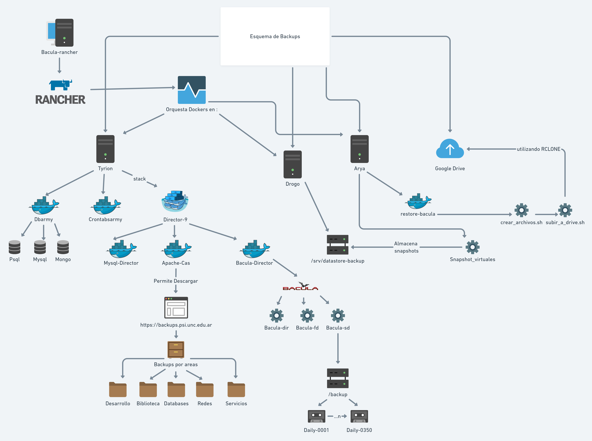

Marco Teórico
=====================

La ISO/IEC 27002 define a la información como un recurso que tiene valor para una organización y por consiguiente debe ser debidamente protegida y a la seguridad de la información como la protección de la información de una amplia variedad de amenazas, con el objeto de asegurar la continuidad del negocio, minimizar los riesgos y maximizar el retorno de la inversión y las oportunidades de negocio. [#ISOIEC27002DEFINFO]_

La ISO incluye dentro de información a las bases de datos y archivos de datos, contratos y acuerdos, documentación de sistemas, información de estudios, manuales de usuario, material de entrenamiento, procedimientos operacionales o de soporte, planes de continuidad del negocio, disposiciones relativas a sistemas de emergencia para la reposición de información perdida ("fallback"), pustas de auditoría e información archivada. [#ISOIEC27002COMPRINFO]_

La seguridad de la información implica:

* Confidencialidad: es la propiedad por la cual la información no esté disponible ni sea divulgada a individuos, organismos o procesos no autorizados.
* Integridad: es la propiedad de proteger la precisión y la totalidad de los activos. Los datos deben mantenerse intactos, libres de modificaciones o alteraciones. 
* Disponibilidad: es la propiedad de estar accesible y ser utilizable a demanda por parte de un organismo autorizado.

Basándose en estas propiedades de la información, es aconsejable que las organizaciones velen para mantenerlas y cumplirlas para que puedan prevenir ante cualquier eventualidad que surja. 

Backup, copia de seguridad o copia de respaldo
-----------------------------------------------

El backup, copia de resguardo, copia de reserva, es una copia exacta de los datos originales de un sistema de información o de un conjunto de software (archivos, documentos, etc) que se  almacena en un lugar seguro, con el fin de poder volver a disponer de su información en caso de que alguna eventualidad, accidente o desastre ocurra y ocasione su pérdida del sistema. [#BCKDEF]_
Los backups responden a las necesidades:

* Copias de recuperación ante desastres, a fin de disponer una copia que subsane la pérdida potencial de datos valiosos para la organización.
* Copias operacionales, a fin de mantener una instantánea de los datos del sistema en un determinado momento con la intención de poder regresar a esa situación. 
* Copias reguladas, a fin de cumplir normativas legales que exigen el almacenado de datos históricos durante un periodo de tiempo. 

Importancia de los backups
--------------------------
La ISO define que el objetivo de un backup o respaldo es mantener la integridad y disponibilidad de la información y de las instalaciones del procesamiento de la información. Además, afirma que se debieran establecer los procedimientos de rutina para implementar la política de respaldo acordada y la estrategia para tomar copias de respaldo de la data y practicar su restauración oportuna. [#ISOIEC27002OBJBACK]_

Dentro de los beneficios que encontramos en el tener un sistema de backup se encuentran:

* Capacidad de respuesta: debido a las copias de respaldo se puede volver a tener un sistema totalmente operativo en un breve lapso de tiempo. 
* Incremento de la confianza del cliente

Tipos de backups
-----------------

Full o completo
""""""""""""""""
Consiste en hacer una copia de todos los datos del sistema en otro soporte. Normalmente, es el punto de partida para el resto de copias de seguridad.
La ventaja principal de este tipo de copia es que proporciona una fácil restauración ya que cada una de las copias se corresponde con un punto de restauración, no necesitando copias previas ni posteriores para que funcione. 
Sería ideal realizar copias de seguridad completas todo el tiempo, ya que son los más completos y auto-contenidas. Sin embargo, la cantidad de tiempo y la cantidad de espacio de almacenamiento que se necesita para ejecutar copias de seguridad completas a menudo impide utilizar este tipo de copia de seguridad. Por esto, es que las copias completas se limitan normalmente a un horaria semanal, quincenal o mensual. Aunque esto último trae aparejado otro problema, que es que no están actualizadas debido a que al espaciarse en el tiempo, por ejemplo una vez al mes, pasa mucho tiempo de un respaldo al siguiente. 
Algo a tener en cuenta es que este tipo de copias tiene un problema de seguridad importante, debido a que las copias son completas, si estas se pierden, son robadas o alguien no autorizado tiene acceso a las mismas, se exponen y comprometen los datos. Por este motivo, es importante cifrar los datos que son backupeados. 

Diferencial
""""""""""""
Consiste en realizar una copia de los archivos que han cambiado desde la última copia full. Su ventaja principal es que son mucho más rápidas que las copias completas porque se hacen copias de muchos menos cambios. Sin embargo, la cantidad de datos crece con cada copia que se hace hasta la siguiente copia completa. 
Cabe aclarar que si cambiaron prácticamente todos los datos desde el último full, entonces el tamaño de será casi el mismo que el de una copia full. 
Normalmente las copias diferenciales ocupan más espacio que las incrementales debido a que parten de la base de un único punto fijo en el tiempo (Copia full).
Restaurar una copia de seguridad diferencial es un proceso mucho más rápido que la restauración de una copia de seguridad incremental, porque sólo se necesitan dos archivos de copia de seguridad de contenedor: la última copia de seguridad completa y la última diferencial.

Incremental
""""""""""""
Consiste en realizar una copia de los archivos que han cambiado desde la última copia, cualquiera sea (full, diferencial o incremental). De esta manera se reduce considerablemente el espacio y tiempo necesario empleado en el proceso de backup. 
El inconveniente de este tipo de copia reside en la recuperación de datos, ya que si se quiere recuperar un directorio completo cuyos archivos han sido modificados poco a poco, se deben recuperar los diferentes archivos de las distintas copias incrementales más la copia completa. Entonces, restaurar una copia de seguridad incremental implica tener una copia full y todas las copias intermedias (diferenciales, incrementales) hasta la que se desea restaurar. Además, un fallo en alguna de las copias internas puede ocasionar que no se pueda restaurar el backup. 

Lineamientos de implementación [#ISOIEC27002LIN]_
"""""""""""""""""""""""""""""""
Los lineamiento de implementación de backup que propone son los siguientes:

Se debiera proporcionar medios de respaldo adecuados para asegurar que toda la información esencial y software se pueda recuperar después de un desastre o falla de medios:
Se debieran considerar los siguientes ítems para el respaldo de la información:

a. se debiera definir el nivel necesario de respaldo de la información;
b. se debieran producir registros exactos y completos de las copias de respaldo y procedimientos documentados de la restauración;
c. la extensión (por ejemplo, respaldo completo o diferencial) y la frecuencia de los respaldos debiera reflejar los requerimientos comerciales de la organización, los requerimientos de seguridad de la información involucrada, y el grado crítico de la información para la operación continua de la organización;
d. las copias de respaldo se debieran almacenar en un lugar apartado, a la distancia suficiente como para escapar de cualquier daño por un desastre en el local principal;
e. a la información de respaldo se le debiera dar el nivel de protección física y ambiental apropiado consistente con los estándares aplicados en el local principal; los controles aplicados a los medios en el local principal se debiera extender para cubrir la ubicación de la copia de respaldo;
f. los medios de respaldo se debieran probar regularmente para asegurar que se puedan confiar en ellos para usarlos cuando sea necesaria en caso de emergencia;
g. los procedimientos de restauración se debieran chequear y probar regularmente para asegurar que sean efectivos y que pueden ser completados dentro del tiempo asignado en los procedimientos operacionales para la recuperación;
h. en situaciones cuando la confidencialidad es de importancia, las copias de respaldo debieran ser protegidas por medios de una codificación.

Los procedimientos de respaldo para los sistemas individuales debieran ser probados regularmente para asegurar que cumplan con los requerimientos de los planes de continuidad del negocio. 

Para sistemas críticos, los procedimientos de respaldo debieran abarcar toda la información, aplicaciones y data de todos los sistemas, necesarios para
recuperar el sistema completo en caso de un desastre.

Se debiera determinar el período de retención para la información comercial esencial, y también cualquier requerimiento para que las copias de archivo se mantengan permanentemente.

------------------------

.. [#ISOIEC27002DEFINFO] ISO/IEC 27002 página 9
.. [#ISOIEC27002COMPRINFO] ISO/IEC 27002 página 32
.. [#BCKDEF] https://concepto.de/backup/
.. [#ISOIEC27002LIN] ISO/IEC 27002 página 60
.. [#ISOIEC27002OBJBACK] ISO/IEC 27002 página 60

