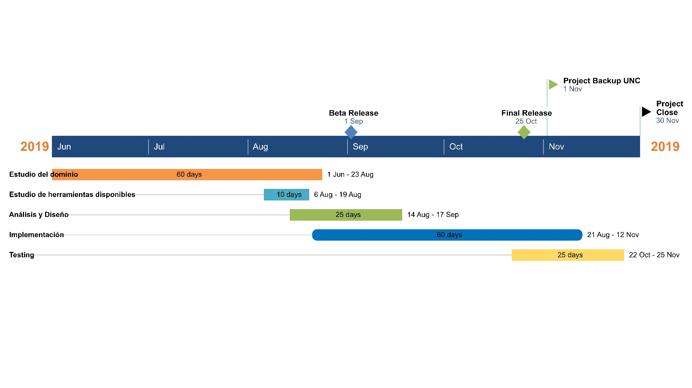

.. Bacula documentation master file, created by
   sphinx-quickstart on Wed Apr 24 11:45:26 2019.
   You can adapt this file completely to your liking, but it should at least
   contain the root `toctree` directive.

Objetivo y problemática del proyecto
=====================================

El siguiente proyecto pretende desarrollar una propuesta para realizar backups en los diversos equipos
de la Prosecretaría Informática de la Universidad Nacional de Córdoba (PSI). 

La PSI [#PSI]_ tiene como misión contribuir con las funciones de docencia, investigación y extensión de la Universidad Nacional de Córdoba, 
coordinando el uso de los recursos relacionados con la informática. 

Para ello sus acciones se encuadran en tres ejes principales:

* Formulación y ejecución de políticas relacionadas con las Tecnologías de Información y Comunicaciones (TICs).
* Adquisición y administración de sistemas de información.
* Planificación y administración de la infraestructura de red y servicios informáticos.

A fin de lograr con esto, la PSI cuenta con una infraestructura de gran envergadura de la cual es importante resguardar los datos. 
Actualmente la UNC, cuenta con un procedimiento para realizar copias de seguridad de la información, pero dado el crecimiento tanto 
en la cantidad de información como en las tecnologías utilizadas, se planteo la necesidad de buscar una nueva solución 
a este nuevo escenario.

El backup, o copia de resguardo, se refiere al proceso de copiar y almacenar datos de diversos equipos (computadoras, switchs, etc)
en otro/otros dispositivos con el objeto de poder restaurar los datos en caso de que la información original se haya eliminado o
sus datos se encuentren corruptos. También brinda la posibilidad de acceder a datos anteriores para buscar archivos específicos de acuerdo
con las políticas de retención de datos definidas.

Objetivo General
-----------------
Implementar un esquema de backups para la Prosecretaría Informática de la Universidad Nacional de Córdoba, para asegurar la persistencia de los datos.

Objetivos Específicos
----------------------

* Captar las necesidades particulares de cada área.
* Determinar qué sistema de backup puede ser implementando en la PSI, en base a políticas definidas.
* Elegir herramientas opensource que se adapten a las necesidades de la prosecretaría.
* Especificar los servicios que ofrecerá el sistema para los distintos usuarios. 
* Analizar las siguientes tecnologías a los fines de poder seleccionar y aplicar en el sistema de backups:
    * Docker
    * Rancher
    * Grafana
    * Ansible
    * Drive
* Realizar un sistema de monitoreo, para el mantenimiento de los servidores.
* Planificar, definir y desarrollar un sistema de backups con despliegue automático. 

Destinatarios
----------------------
El sistema de backups estará dirigido a todas las áreas que interactúen con la PSI.

Beneficios Esperados
----------------------
La implementación de un sistema de backups ofrece diversos beneficios tanto para la PSI como para los usuarios de los diversos sistemas, tales como:

* Capacidad de respuesta: gracias a las copias guardadas, se podrá volver a tener todos los sistemas plenamente operativos en un breve lapso de tiempo.Esto se traduce en un nivel superior de eficiencia, permitiendo restaurar la información y servicios de manera eficaz.
* Incremento de la confianza en los usuarios: al disponer de redundancia de información

.. [#PSI] PSI http://www.psi.unc.edu.ar/

Estudio técnico
-----------------

En el presente proyecto de final de grado se pretende proporcionar una solución de respaldo de información en la Universidad Nacional de Córdoba, 
El proyecto esta en sus primeras etapas de planificación.
Para poder llevarlo a cabo es necesario incorporar ciertos conocimientos:

Tecnologías de utilización
""""""""""""""""""""""""""""

1. Sistema Operativo Linux

    *   Debian
    *   Centos
    *   Ubuntu
    *   Fedora
    *   Red Hat
2. Lenguaje de programación

    *   Bash
    *   Python
    *   C++
3. Herramientas OpenSource para respaldo de información.

Metodología
------------

La metodología para la implementación de un sistema de backups en la Universidad Nacional de Córdoba consistirá en especificar
de forma detallada la infraestructura existente en la PSI. 
Se realizará un relevamiento con los distintos usuarios para conocer, visualizar los distintos casos a realizar 
respaldos dependiendo de cada area.*(Ej: cantidad de archivos, tamaño de archivos, maquinas virtuales, servidores fisicos etc)*.
A su vez se establecerán distintas prioridades de acuerdo a la criticidad de los datos.

Una vez conocido los distintos casos, analizar los distintos esquemas de respaldos y definir cual se adapta más a la necesidad de cada servidor.
Por otro lado, evaluar distintas herramientas de backups OpenSource que se encuentran en el mercado, y en el caso de ser necesario, realizar modificaciones para adaptarlas a nuestro campo de implementación. 

Se considera que la metodologia de **entrega incremental** es la que mejor se adapta a este, ya que las entregas se relacionan
con la implementacion de las distintas políticas

Programación de actividades
-----------------------------

