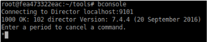
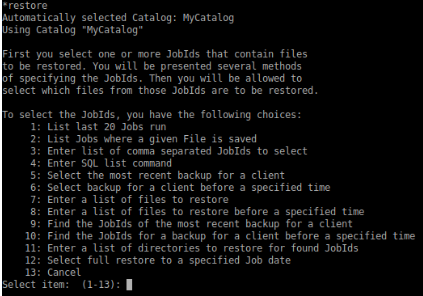
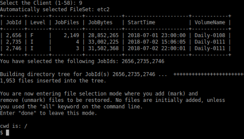
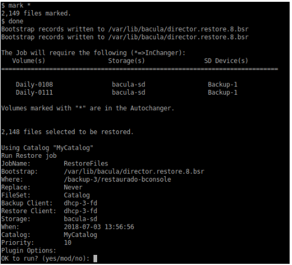
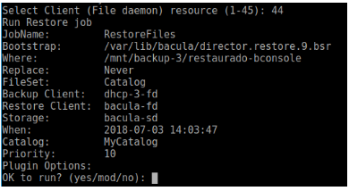

.. Bacula documentation master file, created by
   sphinx-quickstart on Wed Apr 24 11:45:26 2019.
   You can adapt this file completely to your liking, but it should at least
   contain the root `toctree` directive.

Como restaurar backups en bacula
==================================

Pasos para recuperar un backup
------

Para poder recuperar un backup es necesario ingresar al servidor **tyrion**

Una vez ingresados en el servidor ejecutamos

::

    rancher exec -ti director/bacula-director9 bash

* Ya ingresados en el docker ingresamos a la *consola de comandos de bacula*
::

    bconsole

* Ingresamos a la funcion para restaurar 
::

    restore

* Ejecutamos la opcion 5 ( muestra los backups más recientes de ese cliente ) 

Nos mostrara lo siguiente ... 

.. image:: ./_images/restorerecent.png

* Elegir el servidor en que se desea restaurar. Por ejemplo: dhcp-3, por lo que elijo la opcion 9

Antes de seleccionar lo que se desea restaurar, se puede visualizar o buscar un archivo determinado y seleccionar solo lo que se desea recuperar. Se puede navegar en la estructura de lo que se recupera con los comandos normales: cd, ls, pwd, dir. Además se cuentan con otros comandos como: 

* **estimate**: muestra un resumen del total de archivos en el árbol, permitiendo estimar el tamaño de lo que será restaurado. 
* **find**: muestra todos los archivos en el archivo que mapean con el argumento. 
* **mark**: se usa para marcar los archivos o directorios que se desean recuperar. mark * : selecciona todos los archivos
* **lsmark**: es parecido al ls, pero lista solo los archivos marcados para ser restaurados. 
* **unmark**: permite desmarcar archivos seleccionados para ser restaurados. 
* **count**: cuenta la cantidad total de archivos en el árbol de directorio marcados para ser restaurados.
* **done**: termina la selección de archivos

* Si queremos buscar un archivo en particular

::

    find *profile*

* Marcar todos los archivos a ser restaurados

::

    mark *

* Una vez seleccionados todos los arhcivos a ser recuperados colocamos el comando *done*

::

    done

* Bacula permite seleccionar el cliente en el cual se desean restaurar los Datos *RECOMENDAMOS RESTAURAR SIEMPRE EN EL DIRECTOR bacula-fd* . Para esto es necesario modificar el cliente en donde se restaurará. Por lo que es necesario colocar mod

* Hacemos los cambios necesarios para ver donde queremos restaurar el archivo, si queremos que reemplace, etc.

* Verificamos que los cambios en Restore Client se hayan realizado y confirmamos el restore escribiendo *yes*

